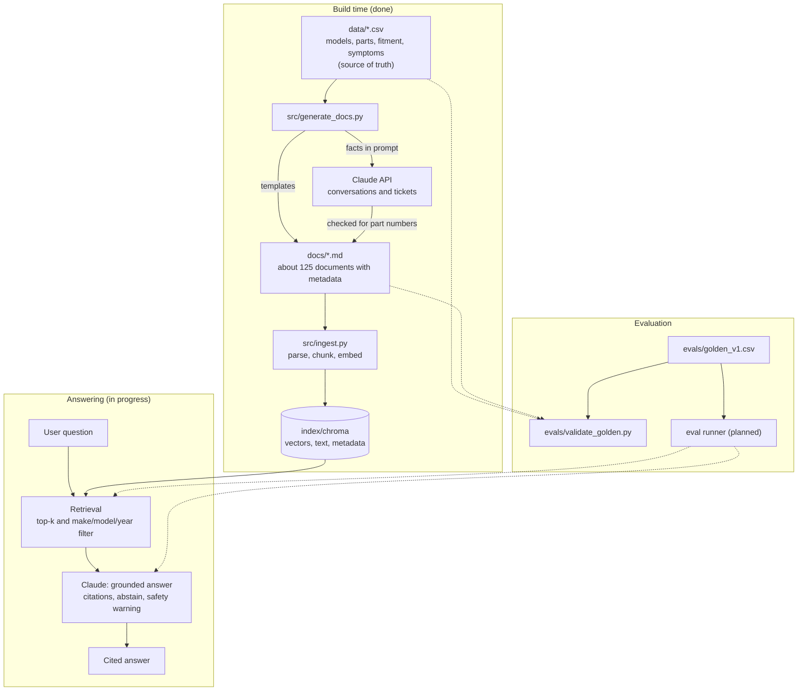

# CarAssist

A RAG assistant for a dealer parts-and-service desk. A customer or service advisor describes a car problem or asks a how-to question, and CarAssist explains the likely cause, the relevant procedure, and the part that fits that exact make, model, and year, with citations.

> All makes, models, specs, and part numbers in this repo are **fictional**. This is a learning project, not real automotive guidance.

**Status:** data, documents, golden test set, and ingestion are built. Retrieval, generation, the evaluation runner, and the hosted demo are in progress (see [Roadmap](#roadmap)).

**Live demo:** _[link, add after deploy]_

## Contents

- [Use case](#use-case) · [Goal](#goal) · [Success criteria](#success-criteria) · [Scope](#scope)
- [Architecture](#architecture)
- [Files and what they do](#files-and-what-they-do)
- [Data](#data) · [Evaluation](#evaluation)
- [Setup](#setup) · [Known limitations](#known-limitations) · [Roadmap](#roadmap)

## Use case

- **Users:** service advisors and customers at a dealer service desk.
- **Questions it handles:** procedures (changing a tire, jump-starting), warning lights, symptoms ("grinding when I brake"), maintenance, and "which part do I need?"
- **Knowledge sources:** manual sections, troubleshooting articles, service bulletins, service tickets, advisor-customer conversations, and FAQs.

## Goal

Give accurate, cited answers for a specific make, model, and year. When the answer isn't in the data, say so or ask a clarifying question instead of guessing.

## Success criteria

| Area | Target |
|---|---|
| Retrieval | The correct source document is in the top 3 for _[X]%_ of golden questions |
| Grounding | Answers use only retrieved content, with a correct citation |
| Fitment | The part number returned fits the stated make, model, and year |
| No invention | Never produces a part number that isn't in the data |
| Honesty | Says "not found" on unanswerable questions; asks which car when none is given |
| Safety | Brake and steering symptoms always carry a safety warning |

## Scope

**In scope:** document RAG with citations, symptom-to-likely-cause reasoning grounded in the documents, part identification.

**Out of scope for now:** pricing, stock, placing orders, and real manufacturer data. The parts catalog is a structured table reserved for a later lookup tool.

## Architecture



**Build time** turns the tables into documents and the documents into a searchable index. It runs once, and again whenever the data changes. **Answering** runs on every question. **Evaluation** checks that the answer key is consistent and (once the runner exists) scores the system against it.

Part numbers and fitment need exact answers, so the parts catalog stays a structured table instead of being searched by similarity.

## Files and what they do

### `data/*.csv` and `data/README.md`
- **What:** four tables that are the single source of truth: `models.csv`, `parts_catalog.csv`, `fitment.csv`, `symptoms.csv`. `data/README.md` is the data dictionary and lists every planted trap.
- **Why it matters:** documents are generated from these tables and every eval answer traces to a cell, so the answer key never depends on a model's judgment.
- **Edit when:** adding a model, part, symptom, or changing a fact. Then regenerate documents and re-run the validator.

### `src/generate_docs.py`
- **What:** reads the four tables and writes the text documents into `docs/`.
- **Two modes:**
  - Default (no API): 107 templated documents. 84 manual sections (7 types for each of the 12 model-years), 11 symptom articles, 5 service bulletins, and 7 FAQs. Facts come straight from the tables.
  - `--llm`: 20 customer-advisor conversations and service tickets written by Claude. The prompt contains only the facts for that case, and a checker rejects any output missing the correct part number, mentioning a different real part, or inventing a part-like code. Up to 3 retries. Failures are written to `docs/_rejected/`.
  - `--llm --dry-run` prints one prompt without calling the API.
- **Run:** `python src/generate_docs.py` then optionally `python src/generate_docs.py --llm` (needs `ANTHROPIC_API_KEY` in `.env`).
- **Key decisions:** templates for facts that must be exact; an LLM only for natural-sounding text, with automatic checking. LLM output is non-deterministic, so the committed `docs/` folder is the frozen corpus.
- **Limits:** the checker validates part numbers only. Other facts in LLM text are spot-checked by hand.

### `src/ingest.py`
- **What:** turns `docs/` into a searchable index. It runs once up front, not per question.
- **Steps:**
  1. **Parse:** separate each document's front matter (make, model, year, doc type) from its text. Folders starting with `_` are skipped.
  2. **Chunk:** documents under 1,500 characters stay as one chunk. Longer ones split on blank lines, never mid-table. Every chunk starts with its title so it identifies the car on its own.
  3. **Metadata:** each chunk keeps make, model, year, doc type, doc ID, and file path. Part numbers on LLM-written documents are deliberately left out, since they are the expected answers.
  4. **Embed and store:** Chroma's default model (all-MiniLM-L6-v2, local and free) turns each chunk into a vector and saves it with the text and metadata in `index/chroma`. The index is deleted and rebuilt each run, so re-running never duplicates.
- **Run:** `python src/ingest.py`. It prints chunk counts by document type.
- **Known weakness:** near-duplicate documents (Tern vs. Vale) embed almost identically, and exact codes like part numbers carry little meaning for an embedding model. This motivates metadata filtering and, later, hybrid search.

### `evals/golden_v1.csv`
- **What:** 29 test questions in plain customer language. Each has an expected answer, expected source documents, expected part number, and expected behavior (`answer`, `clarify`, or `abstain`).
- **Types:** direct, near-duplicate, year trap, cross-document, ambiguous, unanswerable, out-of-scope, safety. Seven are marked `holdout` and are not used while tuning.
- **Columns:** `stated_make/model/year` record what the question itself says (blank when not stated), which shows whether a filter could be applied.
- **Versioning:** scores from different versions are not comparable. Add new versions as `golden_v2.csv` and re-score earlier configurations on them.

### `evals/validate_golden.py`
- **What:** a sanity check of the answer key. It does not run RAG or call any model.
- **Checks:** IDs are unique; every expected source file exists; every expected part is in the catalog and fits the stated car; the stated car exists (except for unanswerable questions); `expected_behavior` is valid.
- **Run:** `python evals/validate_golden.py` from the repo root. Prints counts by type and split, then `All checks passed.` or a list of errors.
- **Re-run when:** tables, documents, or golden questions change. Chunking and embedding changes are scored by the eval runner instead.

### `requirements.txt`, `.gitignore`, `.env`
- `requirements.txt`: Python dependencies (pandas, anthropic, python-dotenv, chromadb).
- `.gitignore`: keeps secrets (`.env`), virtual environments, caches, `index/`, and `docs/_rejected/` out of the repo.
- `.env`: holds `ANTHROPIC_API_KEY`. Never commit it.

### Coming next
- `src/retrieve.py`: top-k search with make/model/year filtering, and a log of misses.
- `src/answer.py`: grounded prompt, citations, abstention, safety warnings.
- `evals/run_evals.py`: runs all golden questions and reports hit@k, MRR, part-number accuracy, abstention and safety rates by question type.
- `app/`: Streamlit chat page with password protection and cost caps.

## Data

| Table | Rows | Contents |
|---|---|---|
| `models.csv` | 12 | 2 makes, 3 models each, 2 model years |
| `parts_catalog.csv` | 31 | part number, name, category, position, price, stock |
| `fitment.csv` | 109 | which part fits which make-model-year |
| `symptoms.csv` | 11 | plain-language symptoms, ranked causes, checks, safety flag |

**Deliberate traps** to stress retrieval:
- Near-duplicate models (Norvik Tern vs. Vale: same specs except lug torque, part numbers one digit apart).
- Year differences on the same model (Aria battery type, Brio spare tire, Cora lug torque and air filter).
- A part that fits only some years, a catalog part that fits no model, and vague or unanswerable questions.

## Evaluation

**Results:** _[add after the first run: hit@k, MRR, part-number accuracy, abstention and safety rates, by question type]_

| Change | hit@3 | MRR | Notes |
|---|---|---|---|
| _baseline_ | | | |

Change one thing at a time and log it here.

## Repo structure

```
carassist/
  data/        # CSV tables (ground truth) + data dictionary
  docs/        # generated text documents (the corpus)
  src/         # generate_docs.py, ingest.py (retrieve.py, answer.py to come)
  evals/       # golden_v1.csv, validate_golden.py (run_evals.py to come)
  app/         # Streamlit app (to come)
  README.md
  requirements.txt
```

## Setup

```bash
python -m venv venv
source venv/bin/activate          # Windows: venv\Scripts\activate
pip install -r requirements.txt

# only needed for LLM-written docs and generation; never commit this file
echo 'ANTHROPIC_API_KEY=your-key' > .env

python src/ingest.py              # builds index/chroma (first run downloads the embedding model)
python evals/validate_golden.py   # checks the answer key
```

## Known limitations

- All data is fictional and generated, so real-world messiness (scanned PDFs, tables, inconsistent naming) is not represented. Parsing real PDFs is a planned extension.
- Templated documents are repetitive by design, which makes near-duplicate retrieval harder. Real manuals read more naturally.
- The LLM-document checker validates part numbers only. Other facts in those documents are spot-checked by hand.
- Every document is currently one chunk, so chunking strategy is not yet a meaningful variable.
- _[Add retrieval and generation failures here as you find them]_

## Roadmap

- [x] Data tables and data dictionary
- [x] Document generation (templated plus LLM with checks)
- [x] Golden test set and validator
- [x] Ingestion (chunk, embed, Chroma)
- [ ] Retrieval with metadata filtering, and a log of misses
- [ ] Grounded generation with citations, abstention, and safety warnings
- [ ] Eval runner (hit@k, MRR, rule checks, LLM judge)
- [ ] Streamlit app with password protection and cost caps, deployed
- [ ] Hybrid search, reranking, and query rewriting
- [ ] Embedding model comparison
- [ ] Rebuild with LangChain and compare
- [ ] LangGraph agent combining RAG with parts-catalog lookup
- [ ] Expose the knowledge base through an MCP server
- [ ] Add a PDF-parsing step with realistic PDFs
